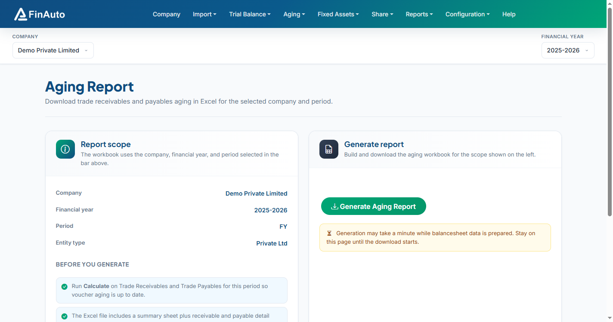

# Aging report

Generate and download an Excel workbook with trade receivables and payables aging for the company, financial year, and period selected in the top bar.

## Prerequisites

- Voucher data imported ([Aging vouchers](vouchers.md) or Tally import with **Import Data for Aging** enabled)
- **Calculate** run on [Trade receivables](receivables.md) and [Trade payables](payables.md) for the current period
- Company, FY, and period set in the company bar

## Steps

### Step 1: Review report scope

1. Go to **Aging → Aging Report**.
2. Confirm **Company**, **Financial year**, **Period**, and **Entity type** on the left card match your intent.

### Step 2: Update aging data (if needed)

1. Open **Trade Receivables**, **Trade Payables**, or **Aging Vouchers** from the quick links if balances are stale.
2. Run **Calculate** on receivables and payables grids before generating.

### Step 3: Generate Excel

1. Click **Generate Aging Report** on the right card.
2. Stay on the page until the download starts (generation may take up to a minute while balance sheet data is prepared).
3. Open the workbook: **Summary** sheet plus **Trade Receivables** and **Trade Payables** detail sheets when data exists.

!!! note "Template format"
    The Excel template depends on entity type (company vs other). The summary sheet lists company name, status, period, and FY end date.

## Related links

- [Aging vouchers](vouchers.md)
- [Trade receivables](receivables.md)
- [Trade payables](payables.md)
- [Import from Tally](../import/tally.md)
- [Balance sheet](../reports/balance-sheet.md)

## Troubleshooting

| Symptom | Likely cause | Resolution |
|---------|--------------|------------|
| Error on generate | Balance sheet prep failed | Check service connection; retry after Calculate on aging grids |
| Empty detail sheets | No rows for period | Import vouchers; verify FY and period in company bar |
| Download stalls | Large dataset | Wait up to 2 minutes; do not navigate away during generation |
| Prior-year balances wrong | Missing prior FY vouchers | Import previous year data for multi-year outstanding items |

See also [Common issues](../../faq/common-issues.md#aging-vouchers-missing).

**Need more help?** Contact [support@finautoindia.com](mailto:support@finautoindia.com). Do not share API keys or PAN in email.
