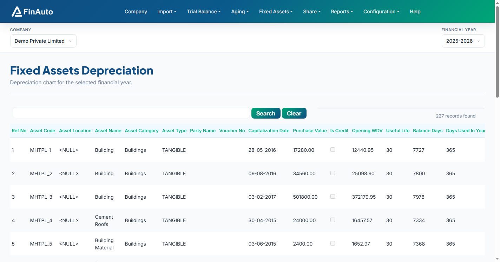

# Depreciation chart

View the financial-year depreciation schedule with WDV, rates, amounts, and net block per asset.

## Prerequisites

- [Fixed asset register](register.md) imported
- Company depreciation method (SLM or WDV) set at company master

## Steps

### Step 1: Open depreciation chart

1. Go to **Fixed Assets → Depreciation Chart** (or **FY Depreciation** per menu).
2. Select company and FY in the top bar if not already set.

### Step 2: Review calculations

1. Scan asset-wise columns: purchase value, WDV, useful life, depreciation rate, depreciation amount, net block.
2. Export visible columns to Excel when needed for audit working papers.

### Step 3: Recalculate after changes

1. After register edits or method changes, allow recalculation to complete (large registers may take several minutes).

## Related links

- [Fixed asset register](register.md)
- [Depreciation by asset](by-asset.md)
- [Balance sheet](../reports/balance-sheet.md)

## Troubleshooting

| Symptom | Likely cause | Resolution |
|---------|--------------|------------|
| Zero depreciation | Missing useful life or rate | Edit asset in register |
| Long wait after method change | Large asset count | Wait for client message estimating recalculation time |
| Chart empty | No assets for FY | Import register data |

See also [Common issues](../../faq/common-issues.md).

**Need more help?** Contact [support@finautoindia.com](mailto:support@finautoindia.com). Do not share API keys or PAN in email.
