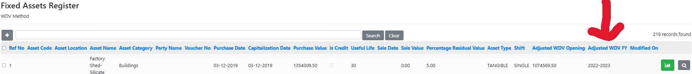

<h2 style="font-weight: bold; color: #0073e6;">🏢 Fixed Assets Tab</h2>

The Fixed Assets module is used to manage, track, and present Property, Plant & Equipment (PPE) data in financial reports.

<h3 style="color: #e67e22; font-weight: bold;">🗂️ Step 1: Importing the Fixed Asset Register</h3>
To begin, import the latest audited Fixed Asset Register using the available Excel template.

<h3 style="color: #e67e22; font-weight: bold;">📄 How to Import:</h3>
Navigate to Fixed Assets → Register.

Scroll to the bottom and download the Excel template provided.

Fill in the asset-wise data in the template.

Upload the completed file through the Import from Excel option.

⚠️ Important: On first-time import, make sure to enter the last Written Down Value (WDV) of each asset as per your audited accounts.
Refer to the screenshot below for the WDV input field.

<h3 style="color: #e67e22; font-weight: bold;">🔁 ⚙️ Depreciation Method Selection</h3>
📝 Note: It is mandatory to select the Depreciation Method — either SLM (Straight Line Method) or WDV (Written Down Value) — when creating or editing a Company Master.

This dropdown is available in the Company Master screen.

Once selected, the method will be applied across all PPE calculations and schedules.

<h3 style="color: #e67e22; font-weight: bold;">🔁 Step 2: Importing Year-on-Year Additions</h3>
Once the base register is imported:

Tally Users: Can import yearly additions directly via the Import tab integrated with Tally.

Non-Tally Users: Use the same Excel template to add new asset entries for the relevant year.

This ensures the Fixed Asset Register remains updated annually.

<h3 style="color: #e67e22; font-weight: bold;">📊 Step 3: Fixed Assets in Financial Statements</h3>
The final PPE Register is automatically plotted in the Financial Statements.

!

A detailed PPE Notes section is generated, providing:

Asset-wise details

Opening balances

Additions

Depreciation

Closing WDV

<h3 style="color: #e67e22; font-weight: bold;">📌 Summary</h3>

| Feature                         | Tally Users         | Excel Import Users     |
|--------------------------------|---------------------|------------------------|
| Initial Import                 | Excel Template      | Excel Template         |
| Yearly Additions               | Tally → Import Tab  | Excel Template         |
| Auto Plot in Financials        | ✅ Yes              | ✅ Yes                 |
| PPE Notes (Schedule II Format) | ✅ Yes              | ✅ Yes                 |

