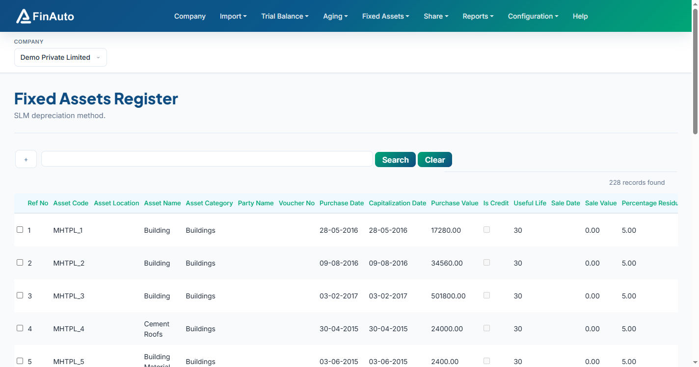
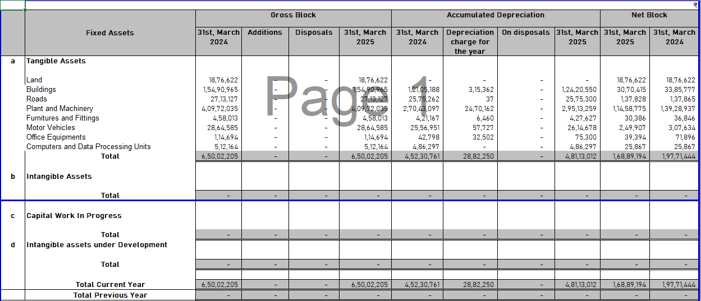

# Fixed asset register

Import and maintain the Property, Plant & Equipment (PPE) register used for depreciation schedules and financial statement notes.

## Prerequisites

- Company created with **depreciation method** (SLM or WDV) set on [Manage company](../company/index.md)
- Audited opening WDV values for first-time import

## Steps

### Step 1: Open register

1. Go to **Fixed Assets → Register**.
2. Review existing asset rows for the selected company.

### Step 2: Import register (first time)

1. Scroll to the bottom and download the Excel template.
2. Enter asset-wise data including **opening WDV** per audited accounts.
3. Upload via **Import from Excel**.

!!! warning "Opening WDV"
    On first import, enter the last written down value (WDV) for each asset exactly as per audited financials. Incorrect opening WDV affects all future depreciation.

### Step 3: Year-on-year additions

- **Tally users:** Import yearly additions via [Import from Tally](../import/tally.md).
- **Excel users:** Add new rows in the same template and re-import.

The register plots automatically in generated financial statements (PPE notes with opening, additions, depreciation, closing WDV).

## Related links

- [Depreciation chart](chart.md)
- [Depreciation by asset](by-asset.md)
- [Asset shifts](asset-shifts.md)
- [Manage company](../company/index.md)

## Troubleshooting

| Symptom | Likely cause | Resolution |
|---------|--------------|------------|
| Import validation errors | Template columns missing | Re-download template from Register page |
| Depreciation method change warning | Existing assets in register | Allow time for recalculation (shown when editing company) |
| PPE notes blank in BS | No register imported | Complete Step 2 import |

See also [Common issues](../../faq/common-issues.md).

**Need more help?** Contact [support@finautoindia.com](mailto:support@finautoindia.com). Do not share API keys or PAN in email.
