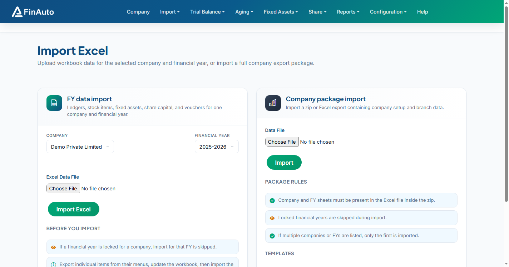

# Import other formats

Import trial balance and related data from third-party Excel layouts using the **Other Formats** import workflow.

## Prerequisites

- Company and FY selected
- Source file matching FinAuto-supported third-party layout (see in-app format hints)

## Steps

### Step 1: Open other formats import

1. Go to **Import → Other Formats**.
2. Read format requirements on the import page.

### Step 2: Upload and import

1. Select your file.
2. Map or confirm columns as prompted.
3. Submit and review any validation errors.

## Related links

- [Import from Excel](excel.md)
- [Ledgers](../trial-balance/ledgers.md)

## Troubleshooting

| Symptom | Likely cause | Resolution |
|---------|--------------|------------|
| Unsupported layout | Wrong file type | Use Excel export from supported ERP template |
| Column mismatch | Extra header rows | Remove title rows; keep standard header line |

See also [Common issues](../../faq/common-issues.md).

**Need more help?** Contact [support@finautoindia.com](mailto:support@finautoindia.com). Do not share API keys or PAN in email.
