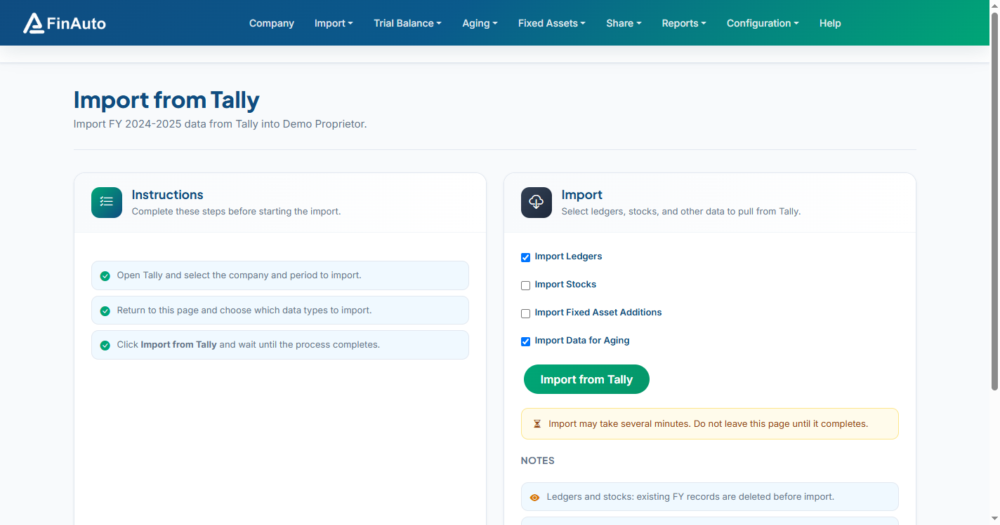

# Import from Tally

Pull ledgers, stock items, fixed assets, aging vouchers, and related data from Tally into the selected company and financial year.

## Prerequisites

- [Tally configured](../../configuration/tally.md) with ODBC on port **9000**
- `tcodes.tcp` plugin installed ([Installation](../install.md))
- Correct **company** and **financial year** selected in the client bar
- Tally open with the matching company and period

## Steps

### Step 1: Prepare Tally

1. Open Tally and load the company you want to import.
2. Set the period to match the client financial year.

### Step 2: Open import screen

1. Go to **Import → From Tally**.
2. Read the **Instructions** card on the left.

### Step 3: Select data and import

1. In the **Import** card, tick the data types to import (ledgers, stock, fixed assets, aging, etc.).
2. Click **Import from Tally**.
3. Wait until the progress message completes — do not close the page during import.

!!! warning "Destructive import for ledgers and stock"
    For the selected FY, existing **ledger** and **stock** records are **deleted** before import. Fixed assets and aging records update when external IDs match.

*Screenshot: FinAuto Client v9.0 — Import → From Tally*

## Related links

- [Installation](../install.md)
- [Tally configuration](../../configuration/tally.md)
- [Ledgers](../trial-balance/ledgers.md)
- [Resolve import conflicts](resolve-conflict.md)

## Troubleshooting

| Symptom | Likely cause | Resolution |
|---------|--------------|------------|
| Connection error port 9000 | Tally ODBC off or Tally closed | Enable ODBC; keep Tally running |
| Income tax number not set | PAN missing in Tally | Configure PAN in Tally company features |
| Import hangs | Large data volume | Wait; check Tally company is responsive |

See also [Common issues](../../faq/common-issues.md).

**Need more help?** Contact [support@finautoindia.com](mailto:support@finautoindia.com). Do not share API keys or PAN in email.
