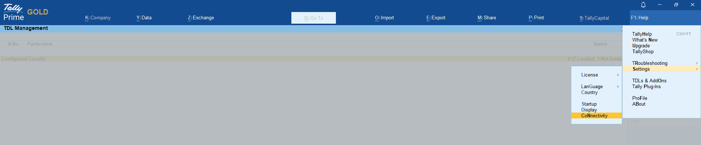
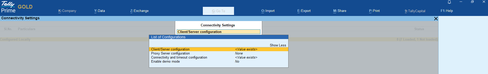
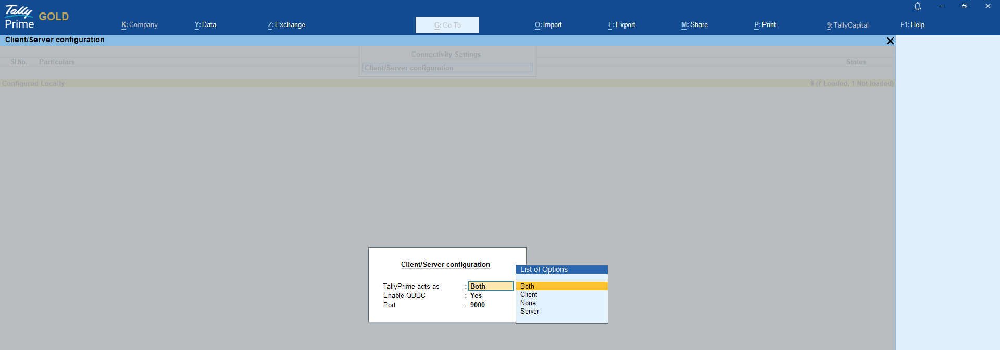
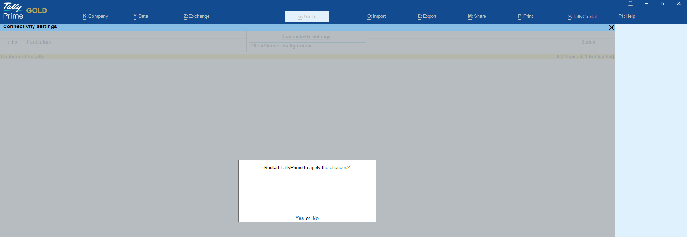
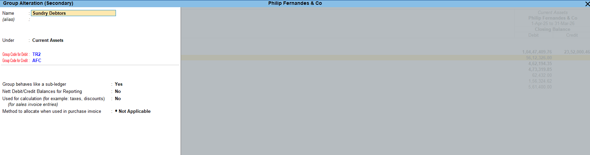
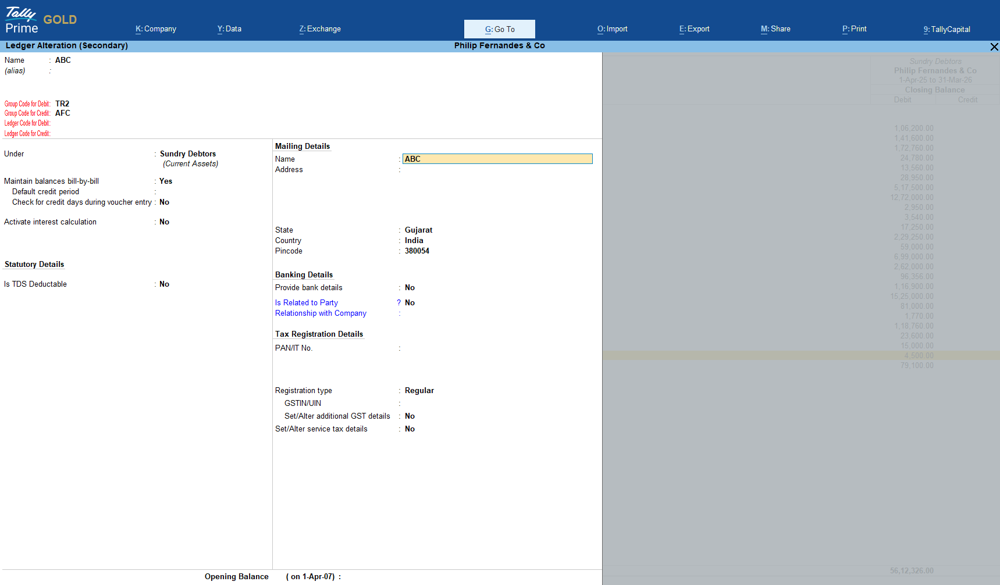

#  <h2 style="font-weight: bold; color: #0073e6;">🛠️ Installation Process – Finauto</h2>

This guide walks you through the complete installation process of the **Finauto Client Software**, from registration to setting up Tally integration.

---

## 🔐 1. Create Your Login Profile

To get started:

- Visit: 🔗 [https://www.finautoindia.com](https://www.finautoindia.com)
- Click on the **Try Now** tab to register and create your login credentials.
- Once registered, your **login profile** will be created and activated.

---

## 🔑 2. Existing Users – Direct Login

If you already have a login profile:

- Go to 🔗 [https://www.finautoindia.com/user/login](https://www.finautoindia.com/user/login)
- Enter your registered email and use the OTP received in your inbox.
- You'll be redirected to your **personal user dashboard**.

---

## 💾 3. Download & Install the Client Software

- After logging in, go to the **Downloads** section.
- Download the latest **`.exe` installer**.
- Run the installer. After installation, you'll see a desktop icon:  
  🖥️ **Finauto Client**

---

## 📁 4. Dashboard Features After Login

Once logged in, your dashboard will display:

- **Current Subscription**  
  Track your plan, activation status, and eligible entities.

- **Demo Data (Excel)**  
  A ZIP file to test the software with sample Excel imports.

- **Demo Data (Tally)**  
  For testing Tally integration with vouchers, ledgers, etc.

- **Templates Section**  
  Download templates for accounting policies and notes.  
  These can be imported into the client software via:  
  `Reports → Customise → Import`.

---

## 🔌 5. Setup Tally Plugin (tcodes.tcp)

Before starting, add the Finauto plugin in Tally:

1. Open Tally and go to `Help → F4: Add-Ons`.
2. Add the plugin path:  
   `C:\Users\Win10\AppData\Local\Programs\Finauto Client\tcodes.tcp`

✅ A screenshot is provided below to guide plugin placement.

## 🔌6. Set Up the ODBC Settings in Tally

a. Open **Tally**.

b. Navigate to:  
   `Help → Settings → Connectivity → Client/Server Configuration`

c. Under **Client/Server Configuration**, select **"Both"** as the mode.

d. Press `Enter` repeatedly to exit and save the configuration.

🟢 You should see the message:  
**"Restart Tally to apply the changes."**

✅ A screenshot is provided below to guide you through the ODBC setup in Tally.

---

## 🚀 7. You're Ready to Use the Software

The Finauto Client is now installed and connected with Tally.

Each feature inside the client software is guided with a **🛈 Help icon**, linking directly to this documentation for step-by-step guidance.

Enjoy seamless automation and simplified financial reporting with **Finauto**.

## 🧩 Step 8: Manual Ledger Code Assignment (If Carry Code / Auto Code not used)

After the software is ready to use and installed successfully, you must ensure that all ledgers in Tally have proper codes assigned for accurate financial statement generation.

### 📝 Instructions:

1. **Login to Finauto client portal** at 🔗 [https://www.finautoindia.com/user/login](https://www.finautoindia.com/user/login)
2. Download the file named **`tally_codes`** under your login dashboard.
3. Open **Tally** and go to the custom code field (activated via plugin) under ledger configuration.
4. **Manually enter the codes** as shown in the `tally_codes` file.

> 📌 **Note:** This step is only required if:
> - 🛑 You are **not using** the **Carry Code** feature.
> - 🛑 You are **not using** the **Auto Code** feature.
---
### 🧠 Additional Features for Tally users:

- 🗂️ **Codes can also be assigned at the group level** — specifically the **last level group** (i.e., the group just above the ledger).
  - ✅ If a code is assigned at the group level, **all ledgers** under that group will **automatically inherit** the group code.
  
- ⭐ **Special Treatment Ledgers**:  
  Users can assign special codes for ledgers that require **custom presentation** or **grouping treatment** in the generated financial statements.

- 🔁 **Auto Group-Level Code Assignment**:
  - If the **Tally plugin (`tcodes.tcp`)** is installed and remains active, any **new ledger created under an already-coded group** will automatically receive the group’s code.
  - Similarly, when a ledger is **moved from one group to another**, the ledger’s code is automatically updated based on the **new group code**.

---

### ⚠️ Warning:

If **any ledger** with an **opening or closing balance** is **not assigned a code**, an **error** will appear in the Finauto client during **Balance Sheet generation**, indicating unclassified ledgers.

📸 Refer to the screenshots below for:

- Group/Ledger code entry screen in Tally.

- Error prompt shown in the Finauto client if codes are missing.
