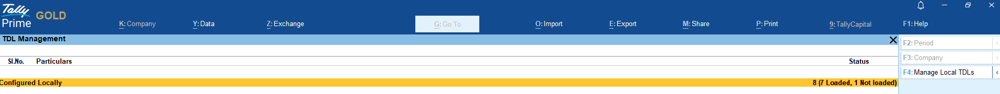
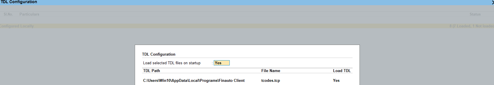

# Installation

Install the FinAuto Client, connect your cloud account, and prepare Tally for ODBC import.

## Prerequisites

- FinAuto cloud account ([register](https://www.finautoindia.com) or [log in](https://www.finautoindia.com/user/login))
- Windows PC with administrator rights to run the `.exe` installer
- TallyPrime (or supported Tally version) if you plan to import from Tally

## Steps

### Step 1: Create or access your cloud account

1. Visit [finautoindia.com](https://www.finautoindia.com) and register, or log in at [finautoindia.com/user/login](https://www.finautoindia.com/user/login).
2. Use OTP email login to reach your user dashboard.

### Step 2: Download and install the client

1. From the dashboard **Downloads** section, download the latest FinAuto Client `.exe`.
2. Run the installer and finish the setup wizard.
3. Launch **FinAuto Client** from the desktop shortcut.

### Step 3: Configure service connection

1. Open **Configuration → Service** in the client.
2. Enter your cloud **domain** and **API key** (generate the key from your FinAuto login dashboard).
3. Click **Update** to sync metadata.

See [Service settings](../configuration/service.md) for details.

*Screenshot: FinAuto Client v9.0 — cloud dashboard reference for downloads and API key*

### Step 4: Install the Tally plugin (tcodes.tcp)

1. In Tally, open **Help → F4: Add-Ons**.
2. Add the plugin path from your FinAuto Client install folder, for example:  
   `C:\Users\<you>\AppData\Local\Programs\Finauto Client\tcodes.tcp`

### Step 5: Enable Tally ODBC (port 9000)

1. In Tally: **Help → Settings → Connectivity → Client/Server Configuration**.
2. Set mode to **Both**.
3. Save and **restart Tally** when prompted.

### Step 6: Verify the client opens

Open the client, select or create a company, and confirm the menu bar and company selector appear. Use the <i class="bi bi-question-circle"></i> **Help** icon on any screen to open contextual documentation.

## Related links

- [Service configuration](../configuration/service.md)
- [Tally settings](../configuration/tally.md)
- [Manage companies](company/index.md)
- [Import from Tally](import/tally.md)

## Troubleshooting

| Symptom | Likely cause | Resolution |
|---------|--------------|------------|
| Tally connection error on port 9000 | Tally not running or ODBC disabled | Open Tally, enable ODBC on port **9000**, restart Tally |
| Invalid API key message | Expired or rotated key | Generate a new key at [finautoindia.com/user/login](https://www.finautoindia.com/user/login), update under **Configuration → Service** |
| Plugin not listed in Tally | Wrong path to `tcodes.tcp` | Re-add plugin under **Help → F4: Add-Ons** |

See also [Common issues](../faq/common-issues.md).

**Need more help?** Contact [support@finautoindia.com](mailto:support@finautoindia.com). Do not share API keys or PAN in email.
