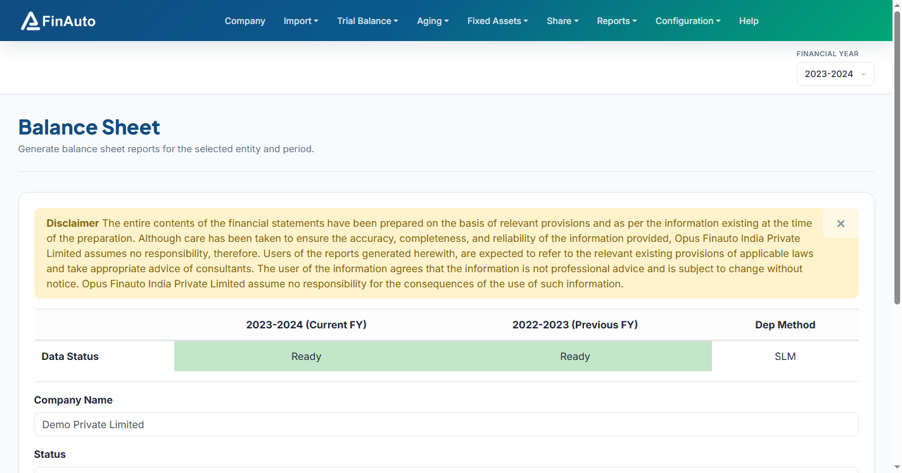

# Customize reports

Configure company-specific report labels, accounting policy text, and disclosure notes used when generating financial statements.

## Prerequisites

- Company selected in the top bar
- Report format chosen on [Manage company](../company/index.md)

## Steps

### Step 1: Open customization grid

1. Go to **Reports → Customize** (or **Accounting Policies** per legacy menu).
2. Review existing customization rows for the company.

### Step 2: Add or edit entries

1. Click **Add** or edit an existing note.
2. Enter section key, display text, and ordering as required by your balance sheet format.
3. Save changes before generating [Balance sheet](../reports/balance-sheet.md).

### Step 3: Verify in output

1. Generate balance sheet for the FY.
2. Confirm custom notes appear in the exported report package.

## Related links

- [Balance sheet](../reports/balance-sheet.md)
- [Manage company](../company/index.md)
- [Fixed asset register](../depreciation/register.md)

## Troubleshooting

| Symptom | Likely cause | Resolution |
|---------|--------------|------------|
| Note not in BS | Wrong company or format | Verify company bar and report format |
| Duplicate sections | Overlapping keys | Remove or merge duplicate customization rows |

See also [Common issues](../../faq/common-issues.md).

**Need more help?** Contact [support@finautoindia.com](mailto:support@finautoindia.com). Do not share API keys or PAN in email.
