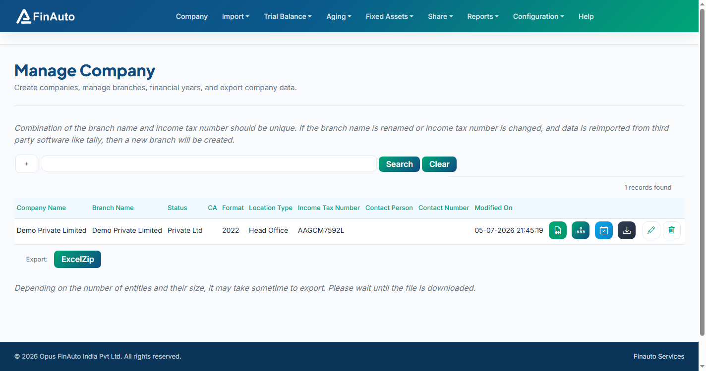

# Subscribed capital

Record shares subscribed by shareholders and import bulk share capital data from Excel.

## Prerequisites

- [Authorized capital](authorized.md) defined
- [Shareholders](holders.md) list (can be created via import)

## Steps

### Step 1: Open subscribed capital

1. Go to **Share → Subscribed**.
2. Review subscribed amounts per shareholder and class.

### Step 2: Import from Excel

1. Scroll to the bottom and click **Download Excel Template**.
2. Fill share details (holder, class, shares, amounts).
3. Go to **Import → Import from Excel** under Share and upload the file.

### Step 3: Verify holdings

1. Update [Shareholder](holders.md) categories after import.
2. Open [Holding report](holding-report.md) to confirm percentages.

## Related links

- [Shareholders](holders.md)
- [Payments](payments.md)
- [Import from Excel](../import/excel.md)

## Troubleshooting

| Symptom | Likely cause | Resolution |
|---------|--------------|------------|
| Import rejected | Invalid holder ID | Create shareholders first or use template IDs |
| Totals do not tie | Rounding in template | Use template formulas; re-export |

See also [Common issues](../../faq/common-issues.md).

**Need more help?** Contact [support@finautoindia.com](mailto:support@finautoindia.com). Do not share API keys or PAN in email.
