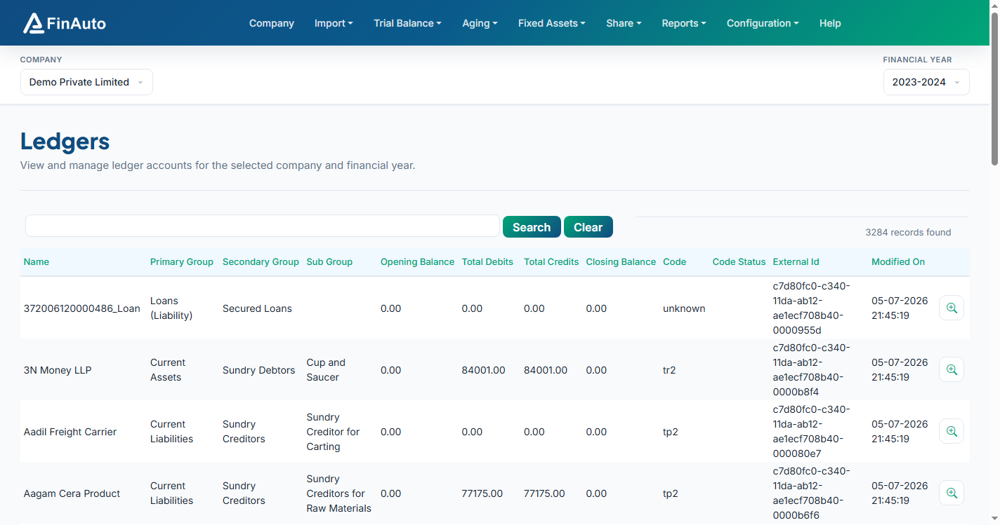

# Ledgers

View and edit ledger accounts for the selected company and financial year, run auto-code, and export trial balance data.

## Prerequisites

- Company and financial year selected
- Trial balance data imported ([Excel](../import/excel.md) or [Tally](../import/tally.md))

## Steps

### Step 1: Open ledgers

1. Go to **Trial Balance → Ledgers**.
2. Review balances in the grid; use search and sort as needed.

### Step 2: Auto-code (optional)

1. If ledgers lack schedule codes, use the **Auto Code** action in the page header (when enabled in service metadata).
2. Review mapped codes before generating reports.

### Step 3: Export

1. Use grid export actions to download ledger data for review or Excel round-trips.
2. Re-import changes via [Import Excel](../import/excel.md) when applicable.

*Screenshot: FinAuto Client v9.0 — Trial Balance → Ledgers*

## Related links

- [Import from Tally](../import/tally.md)
- [Import Excel](../import/excel.md)
- [Coding rules](../../configuration/coding.md)
- [Balance sheet](../reports/balance-sheet.md)

## Troubleshooting

| Symptom | Likely cause | Resolution |
|---------|--------------|------------|
| Unclassified ledger on balance sheet | Missing code | Run auto-code or assign codes manually / in Tally |
| Empty grid | Wrong FY or no import | Confirm FY; re-import trial balance |
| Auto-code disabled | Metadata not refreshed | **Configuration → Service → Update** |

See also [Common issues](../../faq/common-issues.md).

**Need more help?** Contact [support@finautoindia.com](mailto:support@finautoindia.com). Do not share API keys or PAN in email.
