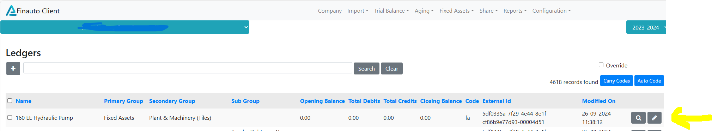

**📋 Trial Balance View**

The Trial Balance View tab provides a consolidated view of all ledger balances imported into the software, including financial and stock ledgers.

📥 **What You Can View:**

-   Complete Trial Balance imported from:

    -Tally (if integrated)

    -Excel (for non-Tally users)

-   Stock Ledgers along with regular ledgers with Groups and sub-groups

✏️ **Edit Ledger Entries**
Each ledger entry can be individually edited if needed.

To edit a ledger:

1.  Navigate to the Trial Balance View tab.

2.  Click the ✏️ Edit button next to the ledger you want to modify.

3.  Make the necessary changes in the popup or side panel.

4.  Click Save to update the ledger details.

🔁 Real-Time Update
Changes made to ledger entries are reflected instantly in the:

-   Trial Balance view

-   Linked reports and statements