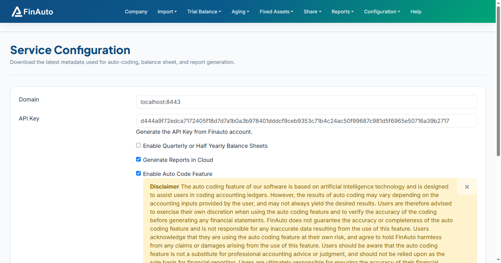

# CA profiles

Create and manage Chartered Accountant profiles printed on balance sheet salutations.

## Prerequisites

- Access to **Configuration → CA Profiles**

## Steps

### Step 1: Create a profile

1. Open **Configuration → CA Profiles**.
2. Click **Add** and enter:

   - CA name
   - Firm name
   - Membership number
   - Address (optional)
3. Save.

### Step 2: Assign to company

1. Open [Manage company](../client/company/index.md).
2. Edit the company and select the **CA profile** from the dropdown.
3. Save.

## Related links

- [Balance sheet](../client/reports/balance-sheet.md)
- [Manage company](../client/company/index.md)

## Troubleshooting

| Symptom | Likely cause | Resolution |
|---------|--------------|------------|
| CA not on balance sheet | Profile not assigned | Set CA on company record |
| Wrong CA printed | Multiple branches | Set profile on correct company entity |

See also [Common issues](../faq/common-issues.md).

**Need more help?** Contact [support@finautoindia.com](mailto:support@finautoindia.com). Do not share API keys or PAN in email.
